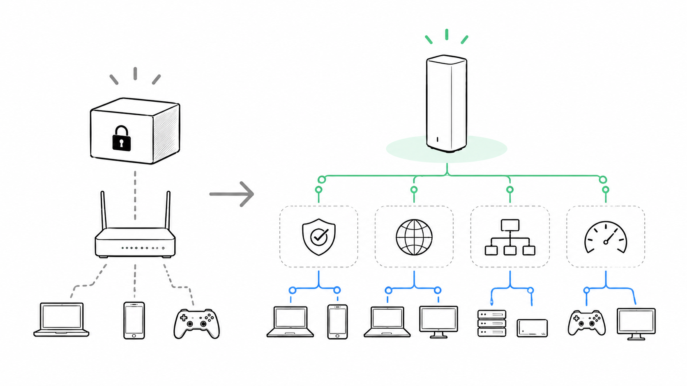
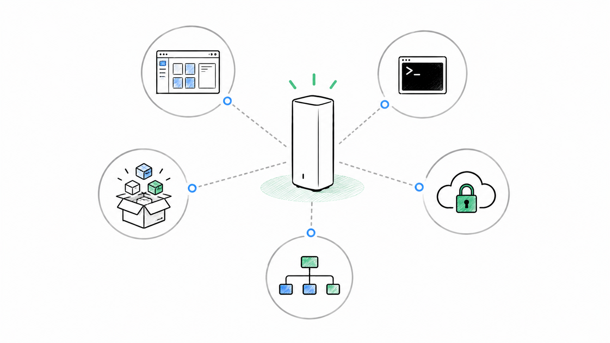
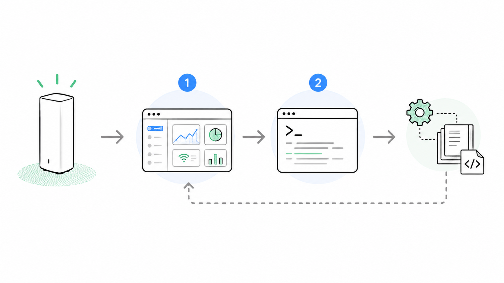

<!-- mirror-source: articles/001-openwrt-intro.md -->

> Original note.com article: [OpenWrtルーターは一般的な市販Wi-Fiルーターとは何が違うのか【OpenWrt集中連載001】](https://note.com/ikmsan/n/n8d8823719244)

# OpenWrtルーターは一般的な市販Wi-Fiルーターとは何が違うのか【OpenWrt集中連載001】

OpenWrtのように細かくカスタマイズできるWi-Fiルーターは面白そうだけど、「日本のIPoE回線で本当に普通に使えるの？」「設定を触りすぎて壊れない？」と不安になる人も多いと思います。

この連載では、OpenWrtベースのWi-Fi 7ルーター「Linksys Velop WRT Pro 7」を使いながら、家庭・小規模オフィス・店舗向けに、“実用的なOpenWrt運用” をわかりやすく紹介していきます。

LN6001-JPは、日本向けに技適や法令へ対応したモデルで、一般的なWi-Fiルーターのように最初からセットアップ済み。OpenWrt系ルーターとしてはかなり始めやすい部類です。

このシリーズでは、実機開発にも関わった立場から、LuCI・SSH・VLAN・VPN・IPoE/IPv6まわりまで、「結局どう設定するのが現実的なのか？」を、画面操作とCLIの両方でまとめていきます。

## 今回の記事を要約すると

OpenWrtは、Wi-Fiルーターを「メーカーが用意した機能だけを使う家電」から、「自分の使い方に合わせてネットワークを設計・拡張できる機器」へ近づけてくれるLinuxベースのルーターOSです。

たとえば、広告ブロック機能を追加したり、VPNやゲストWi-Fiを細かく分けたり、家庭用ルーターでは触れないような部分まで自分で調整できます。

そう聞くと、「なんだか難しそう...」と感じるかもしれません。確かにOpenWrtは自由度が高く、突き詰めればかなりディープなカスタマイズも可能です。ただ、最初からターミナル操作やLinuxコマンドを覚える必要はありません。

OpenWrtには「LuCI（ルーシー）」というWeb管理画面が用意されており、基本的な設定の多くはブラウザ上から操作できます。最近では一般的なWi-Fiルーターに近い感覚で扱える場面も増えてきました。

一方で、日本国内でWi-Fiルーターを扱う場合は「技適（技術基準適合認証）」に注意が必要です。一般的な市販Wi-Fiルーターへ非公式ファームウェアを書き込んで運用する方法は、初心者にはあまりおすすめできません。

そこでこの連載では、Linksys Velop WRT Pro 7（LN6001-JP）を題材に進めていきます。LN6001-JPは、日本国内向けに展開されているOpenWrtベースのWi-Fi 7ルーターで、公式にも国内法令や技適への対応が明示されているモデルです。

そもそも、通常のOpenWrt導入は「対応機種を調べる → ファームウェアを書き込む → 起動しない → 復旧方法を探す...」と、意外とハードルが高い世界です。OpenWrtに興味はあるけれど、「途中で面倒になって挫折した」「インストールに失敗した」という人も少なくありません。

実際、比較的慣れている私でも、検証中に何台かソフトブリック化しています。

LN6001-JPの良いところは、そうした“OpenWrt導入の大変な部分”を最初から飛ばして、実際の活用やネットワーク設計から始められることです。

## この記事でわかること

- OpenWrtが普通の家庭用ルーターとどう違うか
- OpenWrtでできること、逆に最初から触らなくてよいこと
- 日本でOpenWrt系Wi-Fiルーターを考える時の前提
- LN6001-JPがOpenWrtの入口として向いている理由

## OpenWrtって何？

OpenWrt（オープン・ダブリュアールティー）は、LinuxをベースにしたWi-Fiルーター向けの軽量ディストリビューションです。

そのルーツは、2000年代前半に世界的ヒットとなった Linksys WRT54G にあります。当時、この製品に搭載されていたLinuxベースのソースコードが公開されたことをきっかけに、「家庭用Wi-Fiルーターをもっと自由に使いたい」というコミュニティが生まれ、OpenWrtプロジェクトへと発展していきました。

そこから20年以上にわたり、世界中のエンジニアやハードウェアメーカー、ネットワーク愛好家たちが開発へ参加し、対応機種や機能を拡大してきました。現在でもOpenWrtは、ネットワーク分野における最も活発なオープンソースコミュニティのひとつとして進化を続けています。

一般的な家庭用Wi-Fiルーターでは、メーカーが用意した機能の範囲で利用することが前提になります。一方OpenWrtでは、追加パッケージをインストールして機能を拡張したり、VPN・VLAN・広告ブロック・DNS・IPv6・QoS（通信制御）などを、自分の用途に合わせて細かく調整できます。

また、LuCIと呼ばれるWebベースの管理画面も用意されており、Linuxコマンドを使わなくても多くの設定をブラウザ上から操作できます。近年は「高度なネットワーク機能を、比較的身近な形で扱えるルーターOS」として、家庭用途から小規模オフィス、開発用途まで幅広く利用されています。

## OpenWrtで何が変わるのか

一般的な家庭用Wi-Fiルーターは、「買ってすぐ使えること」を最優先に設計されています。これは大きなメリットです。SSIDを設定して、インターネット回線につなぎ、スマートフォンやPCを接続できれば、多くの家庭では十分実用になります。

一方で、少し踏み込んだことをしようとすると、急に“できることの限界”が見えてきます。

- 広告ブロックを導入して、子どもに過激な広告を見せたくない
- ゲストWi-Fiと家庭内LANをきちんと分けたい
- 自宅や事務所へVPNで安全にアクセスしたい
- 子ども用端末やIoT機器だけDNS設定を変更したい
- 回線混雑時でもオンライン会議やゲームの遅延を抑えたい
- どの機器がどこへ通信しているのか把握したい
- 設定をバックアップし、別拠点へ同じ構成を展開したい

こうした「もう少しネットワークを自分の用途に合わせたい」という要求に応えやすいのが、OpenWrt系の環境です。

本来のOpenWrtは、かなり“素のLinux環境”に近く、基本的には自分で必要な設定を積み上げていく前提になっています。ある意味では、それがOpenWrtの自由度の高さでもあります。

一方、今回題材にしている Linksys Velop WRT Pro 7 (LN6001-JP) は、工場出荷時点で日本向けの基本設定やWeb管理画面が整えられており、「OpenWrtを実際に使うところ」から始めやすい構成になっています。

管理画面には「LuCI（ルーシー）」というWeb UIが用意されており、多くの設定はブラウザから操作できます。さらにSSHでログインすれば、CLI経由で設定ファイルを確認したり、より細かなカスタマイズを行うことも可能です。

また、opkg を使って追加パッケージをインストールできる点も、一般的な市販ルーターとの大きな違いです。広告ブロック、VPN、DNS関連機能、通信解析ツールなどを、自分の用途に合わせて追加できます。

ただし、最初からすべてを理解して触る必要はありません。まずはLuCIで状態を確認しながら、「必要になったところだけ少しずつ触る」くらいがちょうど良いと思います。

最近では、ChatGPT、Codex、Claude Codeのような生成AIと組み合わせることで、「こういう設定をしたい」と自然文で相談しながら構築を進めやすくなってきました。以前よりも、“ネットワークを自分で触るハードル”はかなり下がってきていると感じます。

## 日本では「ファームウェアを載せ替えればよい」はNG

OpenWrtについて調べてみると、日本語・英語サイトを問わず、「市販ルーターへOpenWrtをインストールする方法」が数多く紹介されています。海外コミュニティでは、対応機種を購入し、純正ファームウェアを書き換えてOpenWrt化する流れが比較的一般的です。

ただし、日本国内でWi-Fi機器を利用する場合は、技術基準適合認証（いわゆる技適）を無視することはできません。Wi-Fiルーターは、電波を発する無線機器だからです。

一般的な家庭用Wi-Fiルーターへ非公式のOpenWrtファームウェアを書き込んだ場合、周波数、出力、チャネル、DFS（気象レーダー回避）など、無線部分の制御が適切に行われているかを利用者側で保証することは困難です。

海外では普通に紹介されている手法でも、日本国内でそのまま参考にするのは注意が必要です。

中には「出力を下げれば問題ない」と説明しているサイトもありますが、そもそも実際にどのような無線制御になっているのかを検証するのは簡単ではありません。少なくとも、一般ユーザー向けに安易におすすめできるものではないと考えています。

もちろん、無線機能を停止して“有線専用ルーター”として使う方法もあります。ただ、それでは結局別途Wi-FiアクセスポイントやWi-Fiルーターが必要になり、構成が複雑になります。

そのため、この連載では「一般的な市販ルーターへ非公式OpenWrtを導入する方法」は扱いません。

代わりに、国内向けに販売され、技適や国内法令への適合が案内されている Linksys Velop WRT Pro 7 (LN6001-JP) を題材に、「OpenWrt系ルーターを日本の家庭や小規模環境で現実的にどう活用できるのか」を中心に検証していきます。

通常、OpenWrtを一から導入する場合は、次のようなことを自分で調べながら進める必要があります。

- 対応機種の確認
- ファームウェアの入手
- 書き換え手順の確認
- 初期設定
- トラブル時の復旧方法

学習用途としては面白い世界ですが、家庭や仕事で使うルーターとして考えると、導入時の負担は決して小さくありません。

実際、ファームウェアの書き換えに失敗して、いわゆる “soft brick” 状態にしてしまうこともあります。趣味としてはそれも経験になりますが、普段使いのインターネット環境で毎回そこまでのリスクを取りたい人は多くないと思います。

その点、LN6001-JPは「OpenWrtを導入するところ」から始める必要がありません。LinksysがOpenWrtベースの製品として出荷しているため、最初から実利用を前提とした状態で使い始められます。

また、ハードウェア最適化が行われている点も大きな特徴です。一般的なOpenWrt対応機種では、対応自体はしていても、Wi-Fi性能やハードウェアアクセラレーションが十分活用できず、本来の性能を発揮できないケースもあります。

一方LN6001-JPは、メーカー側でハードウェア最適化や動作検証が行われているため、「OpenWrt系の柔軟性」と「市販ルーターとしての完成度」のバランスが取りやすい製品になっています。

なお、この連載ではOpenWrt全般のマニアックな実験や改造を主目的にはしません。あくまで LN6001-JP を実際に家庭や小規模環境で運用するうえで役立つ内容を中心に扱います。

具体的には、次のような実運用に直結するテーマを中心に解説していく予定です。

- LuCIによるWeb管理
- SSHによる基本操作
- IPoE / IPv6設定
- VLAN
- VPN
- Wi-Fi 7
- バックアップと復旧

## LN6001-JPが面白い理由

Linksys Velop WRT Pro 7 (LN6001-JP) は、単なる「高性能Wi-Fi 7ルーター」として見るだけでは少しもったいない製品です。

Linksys公式サポートでも、LN6001-JPは “OpenWrtベースのWi-Fi 7ルーター” として案内されています。一般的な家庭用Wi-Fiルーターとは異なり、LuCIによるWeb管理画面、SSHログイン、opkg によるパッケージ追加、VLAN、OpenVPN、Dynamic DNS、UPnP、MLO（Multi-Link Operation）など、かなり踏み込んだ機能まで利用できます。

さらに、WireGuard や Tailscale についても Linksys公式モジュールが用意されており、「家庭用ルーター」の枠を超えて、自宅ラボや小規模オフィス用途にも踏み込みやすい構成になっています。

日本国内では設定が難しいIPoE（IPv4 over IPv6）環境についても、公式モジュール（オートIPoE）が提供されている点は大きな安心材料です。Map-e、ds-lite、ipip接続に対応し、一般的な動的IPおよび法人利用の多い固定IPにも対応しています。インターネット上のOpenWrt情報により試行錯誤する必要がなく、日本のインターネット環境を前提に使いやすく整理されています。

LN6001-JPのオートIPoEモジュールは以下のサービスに対応しています。

- v6プラス
- OCNバーチャルコネクト
- BIGLOBE IPv6オプション
- transix
- クロスパス
- v6コネクト
- OCX光 v6IX

LN6001-JPはハードウェア面もかなり現代的です。

- QualcommクアッドコアCPU
- 1GB DDR4メモリ
- 2.5GbE WAN
- 1GbE LAN ×4
- 2.4GHz / 5GHz / 6GHz のトライバンド Wi-Fi 7

と、Wi-Fi 7世代のハイエンド構成になっています。

つまり、LN6001-JPの強みは、次の3つが重なっている点にあります。

- OpenWrt系の柔軟性を備えている
- Wi-Fi 7世代のハードウェア性能を活かせる
- 日本国内向け製品として技適・国内法令適合が案内されている

特に3つ目は、日本で利用するうえで非常に重要です。

OpenWrtに興味を持つと、多くの人は対応機種リストや海外フォーラムを調べて、「このルーターにOpenWrtを書き込めるらしい」と試したくなります。実際、それ自体はOpenWrt文化の面白さでもあります。

ただ、日本国内でWi-Fi機器を利用する場合は、「動くかどうか」だけでなく、「国内で適切に扱えるか」まで含めて考える必要があります。

特にビジネス用途では、法令適合は“できれば守る”ではなく、最初から満たしていることが前提です。

LN6001-JPは、そのあたりを気にしながらOpenWrt系環境を扱いたい人にとって、「実験用」ではなく「ビジネス用途でも使えるしっかりチューニングされたWiFiルーター」に近い立ち位置の製品だと感じています。

## この連載で検証すること

この連載では、Linksys Velop WRT Pro 7 (LN6001-JP) を使いながら、次のようなテーマを扱っていきます。

- 初期設定とLuCIの基本操作
- NTT系回線、IPoE、IPv4 over IPv6 の設定
- ゲストWi-Fiと家庭内LANの分離
- VLANを使った小規模オフィス構成
- WireGuard や Tailscale によるリモートアクセス
- DNSや広告ブロックによる名前解決の整理
- バックアップ、復元、ファームウェア更新
- SSHとスクリプトを使ったキッティング
- 通信トラブル時の切り分け
- IPoE と PPPoE の併用や使い分け

ただし、目的は「OpenWrtの機能を全部紹介すること」ではありません。

OpenWrtは自由度が高く、できることを追いかけ始めると、本当に終わりがありません。気づくと、家庭用ルーターの話だったはずが、Linuxサーバーやネットワーク設計そのものの世界へ入っていきます。

もちろん、それもOpenWrtの面白さです。

ただ、この連載では、家庭、小規模オフィス、店舗、小規模事業といった“実際の運用”を前提に、「現実的にどこまで便利にできるか」を重視します。

例えば、次のような“毎日使うネットワーク”としての視点を大切にしたいと思っています。

- 普通に安定してインターネットが使える
- 日本のIPoE環境で困らない
- 家族や仕事に影響を出さずに運用できる
- 必要なところだけ少し便利にする

OpenWrtというと、どうしても「マニア向け」「上級者向け」という印象を持たれがちです。

でも実際には、「必要なところだけ少し触れる」だけでも、家庭用Wi-Fiルーターではできなかったことがかなり実現できます。

この連載が、「OpenWrtは気になるけれど難しそう」と感じている人にとって、“現実的な入り口”になればと思っています。

## OpenWrtルーターを家庭で使う意味

OpenWrtと聞くと、「開発者向け」「実験用」「上級者向け」といった印象を持つ人も多いと思います。たしかにOpenWrtには、細かな設定まで自由に触れる柔軟性があります。

ただ、家庭や小規模オフィスで本当に大事なのは、「難しい設定を全部使いこなすこと」ではありません。むしろ、次のような“ネットワークを見える状態にできること”の方が重要だったりします。

- 自分のやりたいカスタマイズを実現できる
- 今のネットワークがどうなっているか把握できる
- 必要なところだけ調整できる

最近の家庭内ネットワークには、スマートフォン、PC、ゲーム機、テレビ、NAS、プリンター、監視カメラ、IoT家電など、多くの機器がぶら下がります。

そうなると、次のようなことが、一般的な家庭用ルーターでは見えにくくなってきます。

- どの端末がどのIPアドレスを使っているのか
- 来客用Wi-Fiから家庭内機器へアクセスできてしまわないか
- 外出先から安全にアクセスするにはどうするか
- どの機器が通信を大量に使っているのか

OpenWrt系の環境では、こうした状態を自分で確認しながら整理できるのが大きな特徴です。

もちろん、最初から全部を理解する必要はありません。

まずはLuCIのWeb管理画面で状態を確認し、必要に応じてSSHでログを見たり設定を確認する。そして必要になった段階で、次のような機能を少しずつ追加していく。

- IPoE設定
- VLAN
- VPN
- DNS設定
- 広告ブロック

このように“ステップバイステップ”で進めていくと、途中でつまずきにくくなります。

Linksys Velop WRT Pro 7 (LN6001-JP) は、工場出荷時点で基本設定が済んでいるため、DHCP自動取得の一般的な回線環境であれば、電源を入れるだけでWi-Fiを含めてすぐ利用できる状態になっています。

そのため、「OpenWrt系ルーターだから最初から全部CLIで設定しないといけない」というものではありません。

また、万が一設定を崩してしまった場合でも、ハードウェアリセットによって初期状態へ戻せるため、比較的安心して試しながら学びやすい構成になっています。

## 最初に触る範囲を決める

OpenWrtベースのルーターだからといって、最初からすべての設定項目を理解する必要はありません。

実際、最初に触る範囲はかなり限られています。

- LuCI管理画面へのログイン
- ソフトウェア管理
- ネットワーク設定
- Wi-Fi設定（SSIDやパスワード変更）

基本的にはこのくらいです。

しかも、Linksys Velop WRT Pro 7 (LN6001-JP) は初期状態でも普通に動作するため、「OpenWrtだから最初に大量の設定が必要」というわけではありません。

正直、私自身も普段よく触るのはそのあたりが中心です。

ゲストWi-Fiを追加する時も、VPNを導入する時も、IPoEの動作を確認する時も、基本的な流れは変わりません。

- 今どうなっているか確認する
- 設定を変更する
- 変更後の状態を確認する

この繰り返しです。

特にネットワーク系の設定は、「いきなり大量に変更する」よりも、一つずつ状態を確認しながら進める方が、結果的にトラブルを避けやすくなります。

難しそうに見える機能ほど、この順番を崩さないことが大切です。

また、OpenWrtは世界中で長年使われている非常に大きなコミュニティを持っているため、情報量も豊富です。

最近では、ChatGPT や Claude Code、Codex のような生成AIへ「この設定をしたい」「このログの意味は？」と相談しながら進めることもできるようになりました。

もちろん最終的な確認は必要ですが、“何から調べればいいかわからない”状態から抜け出しやすくなっているのは、今のOpenWrt環境の大きな変化だと思います。

## CLI例の前提について

この記事内のCLIサンプルや設定例は、Linksys Velop WRT Pro 7 (LN6001-JP) の OpenWrtベース firmware version 1.2.0.15 を前提にしています。

また、無線の国設定、送信出力、DFS（気象レーダー回避）など、日本国内向け製品としての前提に関わる無線設定については、本連載では変更しません。これらは国内法令や技適に関わる部分でもあり、LN6001-JP側でも適切に制御されています。

そのため、「OpenWrtだから何でも自由に変更できる」というよりも、“国内向け製品として必要な制御を維持したうえで、ネットワーク部分を柔軟に扱える”という理解の方が近いと思います。

また、VLANやネットワーク設定を変更する場合は、事前にバックアップを取得しておくことをおすすめします。

特に、次の設定は、間違えると管理画面へアクセスできなくなることがあります。

- LAN IPアドレス変更
- VLAN設定
- DHCP設定
- ファイアウォール設定

OpenWrt系の環境では、「変更前の状態へ戻せること」がかなり重要です。

まずはバックアップを取り、小さく変更し、動作確認しながら進める。この流れに慣れておくと、トラブル時にも落ち着いて対処しやすくなります。

## OpenWrtが向いている人、向いていない人

Linksys Velop WRT Pro 7 (LN6001-JP) のようなOpenWrtベース製品は、「ネットワークを完全自動の家電として使う」というより、“自分の用途に合わせて少しずつ調整したい人”に向いています。

たとえば、次のような人にはかなり相性が良いと思います。

- 市販ルーターの簡易設定では物足りない
- 広告ブロックを導入して集中しやすい環境を作りたい
- VPNやVLANを自分で設定したい
- 家庭内のIoT機器を分離したい
- 小規模オフィスや店舗のネットワークを整理したい
- 設定内容を理解しながら運用したい

一方で、次のような人には、あまり向いていないかもしれません。

- アプリだけで全部自動設定したい
- ネットワークの仕組み自体は見たくない
- 設定項目が多いだけで負担に感じる

OpenWrt系の環境は、「なんでも設定できる」ことが大きな魅力です。

ただ、その自由度の高さが、同時に“難しそう”に見える理由にもなっています。

実際のところ、普段使いで細かな設定を全部触る必要はほとんどありません。

ただ、LuCIの画面を開いた瞬間に大量の設定項目が並ぶので、「情報量が多すぎて、おえっとなる」という感覚はかなり自然だと思います。

なので最初は、次のようなところから始めるだけでも十分です。

- Wi-Fi設定
- 接続状態の確認
- ソフトウェア追加
- バックアップ

必要になった時に少しずつ機能を足していくくらいの距離感の方が、結果的に長く使いやすいと思います。

## よくある質問

### OpenWrtは普通の家庭用ルーターと何が違う？

一般的な家庭用Wi-Fiルーターは、メーカーがあらかじめ用意した機能や設定項目の範囲で使うことを前提に設計されています。

そのため、次のような用途には非常に使いやすく作られています。

- Wi-Fi名を変える
- パスワードを設定する
- 簡単なポート開放をする

一方で、「もう少し細かく制御したい」と思った瞬間に、触れない部分が急に増えてきます。

対してOpenWrt系ルーターは、ユーザー自身が機能を追加したり、ネットワーク構成をカスタマイズできることが大きな特徴です。

例えば、次のような機能を、より細かく確認・調整しながら、自分の用途に合わせて設計できます。

- Wi-Fi
- DHCP
- DNS
- VLAN
- VPN
- IPv6
- ファイアウォール

もちろん、そのぶん設定項目は増えます。

ただ、「メーカーが決めた範囲の中で使う」のではなく、「自分の環境に合わせて調整できる」という自由度は、一般的な家庭用ルーターとはかなり違います。

たとえば、次のようなことも、比較的柔軟に実現できます。

- 来客用Wi-Fiだけ別ネットワークへ分離する
- 子ども用端末だけDNS制御する
- VPN経由で自宅へ安全にアクセスする
- 特定機器だけ通信制御する

OpenWrtは、“ただインターネットにつながる箱”というより、「自分でネットワークを設計・管理できるルーター環境」に近い存在です。

### 日本で市販Wi-FiルーターにOpenWrtを入れてもいい？

この連載では、一般的な市販Wi-Fiルーターへ非公式にOpenWrtを書き込んで利用する方法は扱いません。

理由は、日本国内でWi-Fi機器を利用する場合、無線部分の技術基準適合（技適）を無視できないためです。

Wi-Fiルーターは単なるネットワーク機器ではなく、「電波を発する無線機器」です。

一般的な家庭用Wi-Fiルーターへ非公式ファームウェアを書き込んだ場合、次のような無線制御が、日本国内向け製品として適切な状態で維持されているかを利用者側で保証することは困難です。

- 周波数設定
- 送信出力
- DFS（気象レーダー回避）
- チャネル制御

日本語サイトや海外フォーラムでは、OpenWrt化の手順そのものは数多く紹介されています。OpenWrt文化としては、それ自体が面白い世界でもあります。

ただ、この連載では、「日本国内で現実的に運用する」という前提を重視しています。

そのため、国内向けに正式販売され、OpenWrtベース製品として案内されている Linksys Velop WRT Pro 7 (LN6001-JP) を題材に扱っています。

LN6001-JPは、OpenWrt系の柔軟性を持ちながら、日本国内向け製品として技適や国内法令への適合が案内されている点が大きな特徴です。

特に家庭用途だけでなく、店舗や小規模オフィスなど、“仕事で使う可能性がある環境”まで考えると、法令適合を前提にできることはかなり重要だと思います。

### OpenWrt初心者なら何から触ればいい？

最初は、LuCIのWeb管理画面を開いて、次のあたりから始めるだけで十分です。

- 回線方式の確認
- Wi-Fi名（SSID）の変更
- パスワード変更
- バックアップ方法の確認

OpenWrtというと、「最初からCLIで全部設定しないといけない」という印象を持たれがちですが、実際にはLuCIだけでもかなり多くのことができます。

特に Linksys Velop WRT Pro 7 (LN6001-JP) は、初期状態で基本設定が済んでいるため、まずは“今どうなっているか”を見るだけでも十分学びになります。

SSHを使い始める場合も、最初から設定ファイルを書き換える必要はありません。

まずは、次のような「読む側」から始める方が、トラブルになりにくいです。

- 状態確認
- ログ確認
- 設定内容を見る

OpenWrt系の環境は、一気に全部理解しようとするとかなり大変です。

なので、次のような小さな単位で進めるのがおすすめです。

- 一つ変更する
- 動作確認する
- バックアップする

また最近では、ChatGPT、Claude Code、Codex などの生成AIへログや設定内容を見せながら相談することで、かなり調査しやすくなっています。

もちろん最終的な確認は必要ですが、「何を調べればいいかわからない」という状態から抜け出しやすくなったのは、以前とかなり違う部分だと思います。

## 参考リンク

- Linksys Velop WRT Pro 7 製品情報 ＆ FAQ: https://support.linksys.com/kb/article/6274-jp/
- Velop WRT Pro 7 よくある質問 FAQ: https://support.linksys.com/kb/article/6899-jp/
- 株式会社アスク製品ページ: https://www.ask-corp.jp/products/linksys/router/velop-wrt-pro-7.html
- OpenWrt trademark policy: https://openwrt.org/trademark

## この連載で使っているOpenWrtルーター

この連載では、Linksys Velop WRT Pro 7（LN6001-JP）を使っています。

https://amzn.to/4tVu4yG

LN6001-JPは、国内向けに展開されているOpenWrtベースのWi‑Fi 7ルーターです。一般的な「自分でOpenWrtを書き込むタイプ」と違い、OpenWrtベースで最適化されたファームウェアを搭載した状態で出荷されるため、かなり導入しやすいのが特徴です。

初期セットアップ済みで、基本的には電源を入れてすぐ利用可能。LuCIブラウザ管理画面、SSH、opkg、VLAN、OpenVPN、WireGuard、Tailscaleなど、OpenWrtらしい拡張性も備えています。

特に日本の回線環境向けとして、Linksys公式の「オートIPoE」モジュールが用意されているのが大きなポイントです。OCNバーチャルコネクト、transixなどのIPv4 over IPv6環境でも、LuCIから比較的シンプルに設定できます。

もちろんCLIで細かく調整していく楽しさもありますが、MAP-EやIPIPは設定項目がかなり多いため、「まず普通に安定して使いたい」という場合はオートIPoEを使った方がかなり楽です。

この連載では、実機開発にも関わった立場から、家庭・小規模オフィス・店舗などで“実際どう使うと快適なのか” を中心に、現実的なOpenWrt運用を紹介していきます。

### 使用機材

- 製品名: Linksys Velop WRT Pro 7
- 型番: LN6001-JP
- 用途: 家庭〜小規模オフィス・店舗向け OpenWrt ベースルーター
- 製品情報: https://support.linksys.com/kb/article/6274-jp/
- IPoE設定方法: https://support.linksys.com/kb/article/6902-jp/
- WireGuard / Tailscale設定方法: https://support.linksys.com/kb/article/8723-jp/

※設定変更前はバックアップをおすすめします。ファームウェア更新によって画面や項目名が変わる場合があるため、必要に応じてLinksys公式サポートもあわせて確認してください。
